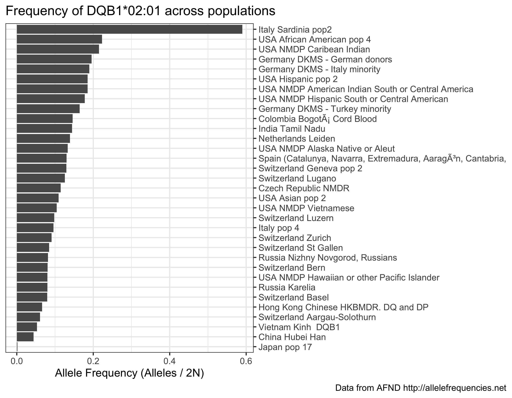

# HLA allele frequencies in tab-delimited format

Kamil Slowikowski

2023-06-16

**Table of Contents**

- [HLA allele frequencies in tab-delimited
  format](#hla-allele-frequencies-in-tab-delimited-format)
  - [Introduction](#introduction)
  - [Examples](#examples)
  - [Citation](#citation)
  - [Related work](#related-work)
  - [Acknowledgments](#acknowledgments)

## Introduction

Here, we share a single file [afnd.tsv](afnd.tsv) (5.99MB) in
tab-delimited format with all allele frequencies for 8 HLA genes, 18 KIR
genes, 2 MIC genes, and 29 cytokine genes from [Allele Frequency Net
Database](http://allelefrequencies.net) (AFND).

The script [allelefrequencies.py](allelefrequencies.py) automatically
downloads allele frequencies from the website.

[What is the Allele Frequency Net
Database?](http://www.allelefrequencies.net/faqs.asp)

> The Allele Frequency Net Database (AFND) is a public database which
> contains frequency information of several immune genes such as Human
> Leukocyte Antigens (HLA), Killer-cell Immunoglobulin-like Receptors
> (KIR), Major histocompatibility complex class I chain-related (MIC)
> genes, and a number of cytokine gene polymorphisms.

The [afnd.tsv](afnd.tsv) file looks like this:

``` r
d <- fread("afnd.tsv")
head(d)
```

    ##    group gene  allele                              population indivs_over_n alleles_over_2n   n
    ## 1:   hla    A A*01:01                  Argentina Rosario Toba          15.1          0.0760  86
    ## 2:   hla    A A*01:01                Armenia combined Regions                        0.1250 100
    ## 3:   hla    A A*01:01 Australia Cape York Peninsula Aborigine                        0.0530 103
    ## 4:   hla    A A*01:01      Australia Groote Eylandt Aborigine                        0.0270  75
    ## 5:   hla    A A*01:01     Australia New South Wales Caucasian                        0.1870 134
    ## 6:   hla    A A*01:01            Australia Yuendumu Aborigine                        0.0080 191

Definitions:

- `alleles_over_2n` (Alleles / 2n) Allele Frequency: total number of
  copies of the allele in the population sample in three decimal format.

- `indivs_over_n` (100 \* Individuals / n) Percentage of individuals who
  have the allele or gene.

- `n` (Individuals) Number of individuals sampled from the population.

## Examples

Here are a few examples of how we can use R to analyze these data.

View the largest and smallest populations available in the data:

``` r
d %>%
  mutate(n = parse_number(n)) %>%
  select(population, n) %>%
  unique() %>%
  arrange(-n)
```

    ##                                     population       n
    ##    1:             Germany DKMS - German donors 3456066
    ##    2:              USA NMDP European Caucasian 1242890
    ##    3:          USA NMDP African American pop 2  416581
    ##    4:              USA NMDP Mexican or Chicano  261235
    ##    5:              USA NMDP South Asian Indian  185391
    ##   ---                                                 
    ## 1489:                            Cameroon Sawa      13
    ## 1490:    Paraguay/Argentina Ache NA-DHS_24 (G)      13
    ## 1491:            Malaysia Orang Kanaq Cytokine      11
    ## 1492:                      Cameroon Baka Pygmy      10
    ## 1493: Paraguay/Argentina Guarani NA-DHS_23 (G)      10

Count the number of alleles for each gene:

``` r
d %>%
  count(group, gene, allele) %>%
  count(group, gene) %>%
  arrange(-n) %>%
  head(15)
```

    ##     group  gene    n
    ##  1:   hla     B 1979
    ##  2:   hla     A 1394
    ##  3:   hla     C 1209
    ##  4:   hla  DRB1  954
    ##  5:   hla  DPB1  384
    ##  6:   hla  DQB1  351
    ##  7:   kir  3DL1   90
    ##  8:   mic  MICA   69
    ##  9:   kir  3DL3   67
    ## 10:   kir  2DL1   52
    ## 11:   kir  2DL4   35
    ## 12:   mic  MICB   34
    ## 13:   hla  DQA1   30
    ## 14:   kir  3DL2   30
    ## 15:   kir 2DL5B   24

Sum the allele frequencies for each gene in each population. This allows
us to see which populations have a set of allele frequencies that adds
up to 100 percent:

``` r
d %>%
  mutate(alleles_over_2n = parse_number(alleles_over_2n)) %>%
  filter(alleles_over_2n > 0) %>%
  group_by(group, gene, population) %>%
  summarize(sum = sum(alleles_over_2n)) %>%
  count(sum == 1)
```

    ## `summarise()` has grouped output by 'group', 'gene'. You can override using the `.groups` argument.

    ## # A tibble: 44 × 4
    ## # Groups:   group, gene [28]
    ##    group gene  `sum == 1`     n
    ##    <chr> <chr> <lgl>      <int>
    ##  1 hla   A     FALSE        420
    ##  2 hla   A     TRUE          18
    ##  3 hla   B     FALSE        513
    ##  4 hla   B     TRUE          19
    ##  5 hla   C     FALSE        323
    ##  6 hla   C     TRUE          19
    ##  7 hla   DPA1  FALSE         54
    ##  8 hla   DPA1  TRUE           6
    ##  9 hla   DPB1  FALSE        207
    ## 10 hla   DPB1  TRUE          39
    ## # ℹ 34 more rows

Plot the frequency of a specific allele in populations with more than
1000 sampled individuals:

``` r
my_allele <- "DQB1*02:01"
my_d <- d %>% filter(allele == my_allele) %>%
  mutate(
    n = parse_number(n),
    alleles_over_2n = parse_number(alleles_over_2n)
  ) %>%
  filter(n > 1000) %>%
  arrange(-alleles_over_2n)

ggplot(my_d) +
  aes(x = alleles_over_2n, y = reorder(population, alleles_over_2n)) +
  scale_y_discrete(position = "right") +
  geom_colh() +
  labs(
    x = "Allele Frequency (Alleles / 2N)",
    y = NULL,
    title =  glue("Frequency of {my_allele} across populations"),
    caption = "Data from AFND http://allelefrequencies.net"
  )
```

<!-- -->

## Citation

If you use this data, please cite the latest manuscript about **Allele
Frequency Net Database**:

- Gonzalez-Galarza FF, McCabe A, Santos EJMD, Jones J, Takeshita L,
  Ortega-Rivera ND, et al. [Allele frequency net database (AFND) 2020
  update: gold-standard data classification, open access genotype data
  and new query tools.](https://pubmed.ncbi.nlm.nih.gov/31722398)
  Nucleic Acids Res. 2020;48: D783–D788. <doi:10.1093/nar/gkz1029>

<!-- -->

    @ARTICLE{Gonzalez-Galarza2020,
      title    = "{Allele frequency net database (AFND) 2020 update: gold-standard
                  data classification, open access genotype data and new query
                  tools}",
      author   = "Gonzalez-Galarza, Faviel F and McCabe, Antony and Santos, Eduardo
                  J Melo Dos and Jones, James and Takeshita, Louise and
                  Ortega-Rivera, Nestor D and Cid-Pavon, Glenda M Del and
                  Ramsbottom, Kerry and Ghattaoraya, Gurpreet and Alfirevic, Ana
                  and Middleton, Derek and Jones, Andrew R",
      journal  = "Nucleic acids research",
      volume   =  48,
      number   = "D1",
      pages    = "D783--D788",
      month    =  jan,
      year     =  2020,
      language = "en",
      issn     = "0305-1048, 1362-4962",
      pmid     = "31722398",
      doi      = "10.1093/nar/gkz1029",
      pmc      = "PMC7145554"
    }

## Related work

Here are all of the resources I could find that have information about
HLA allele frequencies in different populations.

### CIWD version 3.0.0

- Hurley CK, Kempenich J, Wadsworth K, Sauter J, Hofmann JA, Schefzyk D,
  et al. [Common, intermediate and well-documented HLA alleles in world
  populations: CIWD version
  3.0.0.](https://www.ncbi.nlm.nih.gov/pubmed/31970929) Hladnikia.
  2020;95: 516–531. <doi:10.1111/tan.13811>

The authors provide xlsx files on this website:

- <https://www.ihiw18.org/component-immunogenetics/download-common-and-well-documented-alleles-3-0>

But the frequency information is binned into categories:

- C, common
- I, intermediate
- WD, well-documented
- NA, not applicable

There is a tool called
[HLA-Net](https://hla-net.eu/tools/cwd-viewer/results/) that provides a
visualization of the CIWD data.

### IEDB Tools

<http://tools.iedb.org/population/download>

At the IEDB Tools page, we can find a tool called **Population
Coverage**. The authors have downloaded the HLA frequency information
from AFND and saved it in a Python pickle file.

### dbMHC

<https://www.ncbi.nlm.nih.gov/gv/mhc>

The dbMHC database and website appears to be discontinued. But an
archive of old files is still available via FTP.

## Acknowledgments

Thanks to David A. Wells for sharing
[scrapeAF](https://github.com/DAWells/scrapeAF), which inspired me to
work on this project.
