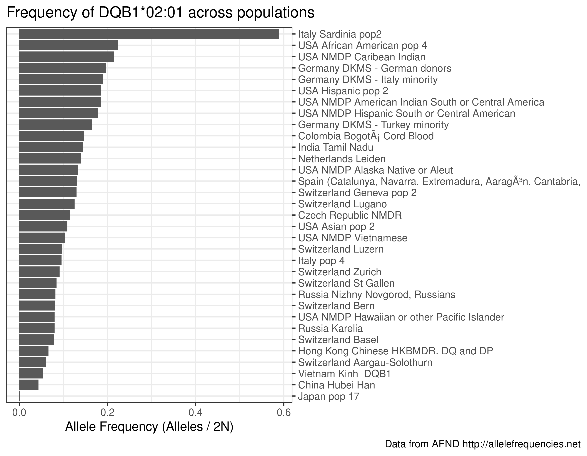

Allele Frequencies Net Database
================
Kamil Slowikowski
2023-03-14

## Introduction

Here, we share a script `allelefrequencies.py` to download allele
frequencies for HLA, KIR, MIC, and cytokine genes from [Allele Frequency
Net Database](http://allelefrequencies.net) (AFND).

We also share [57 TSV files](allelefrequencies.net/) ready for analysis.

Each file looks like this:

``` r
d <- fread("allelefrequencies.net/hla/A.tsv")
head(d)
```

    ##     allele                              population indivs_over_n alleles_over_2n   n
    ## 1: A*01:01                  Argentina Rosario Toba          15.1          0.0760  86
    ## 2: A*01:01                Armenia combined Regions                        0.1250 100
    ## 3: A*01:01 Australia Cape York Peninsula Aborigine                        0.0530 103
    ## 4: A*01:01      Australia Groote Eylandt Aborigine                        0.0270  75
    ## 5: A*01:01     Australia New South Wales Caucasian                        0.1870 134
    ## 6: A*01:01            Australia Yuendumu Aborigine                        0.0080 191

Definitions:

    alleles_over_2n (Alleles / 2n)
    Allele Frequency: total number of copies of the allele in the population sample
    in three decimal format.
    
    indivs_over_n (Individuals / n)
    Percentage of individuals who have the allele or gene.

## Examples

Here are a few examples of how we can use R to analyze these data.

View the largest and smallest populations available in the data:

``` r
d %>%
  mutate(n = parse_number(n)) %>%
  select(population, n) %>%
  unique() %>%
  arrange(-n)
```

    ##                                    population       n
    ##   1:             Germany DKMS - German donors 3456066
    ##   2:              USA NMDP European Caucasian 1242890
    ##   3:          USA NMDP African American pop 2  416581
    ##   4:              USA NMDP Mexican or Chicano  261235
    ##   5:              USA NMDP South Asian Indian  185391
    ##  ---                                                 
    ## 436:                          Bulgaria Romani      13
    ## 437:                            Cameroon Sawa      13
    ## 438:    Paraguay/Argentina Ache NA-DHS_24 (G)      13
    ## 439:                      Cameroon Baka Pygmy      10
    ## 440: Paraguay/Argentina Guarani NA-DHS_23 (G)      10

Sum the allele frequencies for each population and see if they add up to
100%:

``` r
d %>%
  mutate(alleles_over_2n = parse_number(alleles_over_2n)) %>%
  group_by(population) %>%
  summarize(sum = sum(alleles_over_2n)) %>%
  count(sum == 1)
```

    ## # A tibble: 2 × 2
    ##   `sum == 1`     n
    ##   <lgl>      <int>
    ## 1 FALSE        403
    ## 2 TRUE          37

Plot the frequency of a specific allele in populations with more than
1000 sampled individuals:

``` r
d <- fread("allelefrequencies.net/hla/DQB1.tsv")
my_allele <- "DQB1*02:01"
my_d <- d %>% filter(allele == my_allele) %>%
  mutate(
    n = parse_number(n),
    alleles_over_2n = parse_number(alleles_over_2n)
  ) %>%
  filter(n > 1000) %>%
  arrange(-alleles_over_2n)

ggplot(my_d) +
  aes(x = alleles_over_2n, y = reorder(population, alleles_over_2n)) +
  scale_y_discrete(position = "right") +
  geom_colh() +
  labs(
    x = "Allele Frequency (Alleles / 2N)",
    y = NULL,
    title =  glue("Frequency of {my_allele} across populations"),
    caption = "Data from AFND http://allelefrequencies.net"
  )
```

<!-- -->

## Citation

If you use this data, please cite the latest manuscript about **Allele
Frequency Net Database**:

  - Gonzalez-Galarza FF, McCabe A, Santos EJMD, Jones J, Takeshita L,
    Ortega-Rivera ND, et al. [Allele frequency net database (AFND) 2020
    update: gold-standard data classification, open access genotype data
    and new query tools.](https://pubmed.ncbi.nlm.nih.gov/31722398)
    Nucleic Acids Res. 2020;48: D783–D788. <doi:10.1093/nar/gkz1029>

Also, I want to say thanks to David A. Wells for sharing
[scrapeAF](https://github.com/DAWells/scrapeAF), which inspired me to
work on this project.
